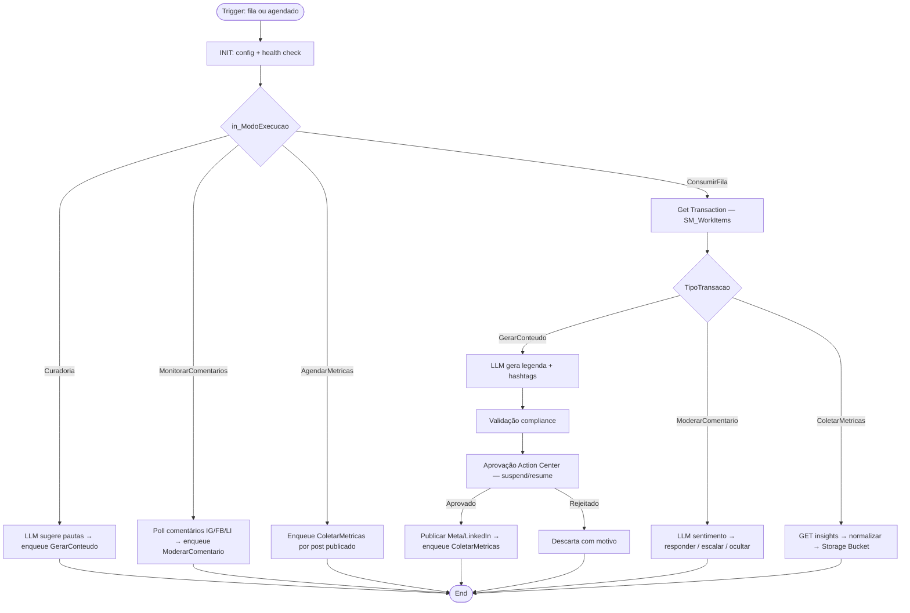

# Solution Design Document — clarituz-agente-social-midia

> **Template:** RPA Process.
> **Fonte do processo:** elicitação em conversa (não existe PDD formal) — requisitos levantados via perguntas de escopo na sessão de design.

---

## Document History

| Date | Version | Author | Role | Comments |
|---|---|---|---|---|
| 2026-09-25 | 1.0 | Vinicius Moreira (Engenheiro RPA) | Generated by AI Agent | SDD inicial gerado a partir da elicitação de requisitos |

---

<!-- DO NOT RENAME: uipath-planner detects SDDs via this exact heading or the marker below. -->
<!-- planner-handoff:v1 -->
## Planner Handoff

| Field | Value |
|---|---|
| **Status** | draft |
| **Execution autonomy** | autonomous |
| **Delivery model** | cloud (Automation Cloud — org `clarituz`, tenant `DefaultTenant`, detectado via `uip login status`) |
| **SDD scope** | single-product |
| **Project list section** | §11 |
| **Tasks file** | `clarituz-agente-social-midia-tasks.md` |
| **Generated by** | uipath-planner |
| **Generation date** | 2026-09-25 |
| **Template validation** | pending |

---

## Decisions Made

> Autonomous mode picked the five architectural decisions below without a user checkpoint. Override by rerunning in Interactive mode (`Execution autonomy: interactive` in the Planner Handoff header above) or by editing the relevant SDD section.

| # | Decision | Picked | One-sentence reason |
|---|---|---|---|
| 1 | **Platform constraints** (Constraint Gate) | cloud; no products blocked | `uip login status` resolved `cloud.uipath.com` — catálogo completo disponível |
| 2 | **Scope** (Level 1) | Single product — RPA Process | Um único host absorve as chamadas LLM e a aprovação in-flight; sem pares de runtime para orquestrar |
| 3 | **RPA sub-type** (Level 1.5) | Process | Processo de negócio ponta a ponta, sem sinais de Library ou Test Automation |
| 4 | **Authoring mode** (Level 2) | Hybrid | Integrações REST com paginação e DTOs tipados justificam C#; o shell XAML preserva REFramework + persistência |
| 5 | **Framework** | REFramework + Persistence | Itens de fila com sucesso/falha independentes; aprovação humana suspende o job (Action Center) |

---

## Recommended Scope

**Recommendation:** SINGLE_PRODUCT — RPA Process (`clarituz-agente-social-midia`)
**Delivery model:** cloud
**Blocked by platform:** none
**Need profile:** operação recorrente de social media — gerar conteúdo via LLM, publicar em Instagram/Facebook/LinkedIn via APIs oficiais, moderar comentários e coletar métricas — reduzindo esforço manual e tempo de resposta; gate humano obrigatório antes de cada publicação.

---

## Table of Contents

1. Process Overview
2. Process Map
3. Detailed Process Steps
4. Business Rules
5. Data Definitions
6. Value Mappings
7. Exception Handling
8. Error Handling
9. Application Inventory
10. Master Project Architecture
11. Project Structure
12. Queue Architecture
13. Implementation Mode
14. Packages
15. Credentials & Assets
16. Deployment Environment
17. Testing Strategy
18. Next Steps

---

## 1. Process Overview

| Field | Value |
|---|---|
| **Process name** | clarituz-agente-social-midia (persona: "Camila" — Social Media, especialista em campanhas de alta conversão) |
| **Objective** | Automatizar o ciclo de social media: curadoria de pautas → geração de conteúdo por LLM → aprovação humana → publicação multi-plataforma → moderação de comentários → coleta de métricas |
| **Department / Function** | Marketing — Social Media |
| **Schedule** | Dispatcher de curadoria: 1×/dia [DEFAULT]; monitoramento de comentários: a cada 15–30 min [DEFAULT]; consumo da fila: por queue trigger; métricas: 1×/dia [DEFAULT] |
| **Volume** | Até 3 posts/dia por plataforma [DEFAULT]; ~50 comentários/dia [DEFAULT] [SME REVIEW] confirmar volume real com o time de marketing |
| **Avg. handling time (manual)** | ~45 min por post (pauta + copy + publicação + checagem) [DEFAULT] |
| **Avg. handling time (automated target)** | ~2–3 min por item de fila (exclui espera de aprovação) |
| **Exception rate** | ~10–15% estimado (rejeições de aprovação, violações de compliance, falhas de API) |
| **Source PDD** | Conversa de elicitação — 2026-09-25 (sem documento formal) |

### Delivery Team

| Role | Name | Contact |
|---|---|---|
| SME / Process Owner | [SME REVIEW] responsável pelo canal de social media da Clarituz | — |

### In Scope

- Curadoria de pautas: LLM sugere temas por nicho/tendência → itens na fila
- Geração de conteúdo: legenda, hashtags e prompt de mídia via UiPath GenAI / LLM Gateway
- Validação de compliance do conteúdo (tamanho, termos proibidos, presença de mídia)
- Aprovação humana obrigatória via Action Center antes de publicar
- Publicação via Meta Graph API (Instagram Business + Facebook Page) e LinkedIn API
- Moderação de comentários: classificação de sentimento via LLM → resposta automática (positivo/neutro), escalonamento (negativo/crise), ocultação (spam)
- Coleta de métricas por post publicado (alcance, impressões, curtidas, comentários, salvamentos) → persistência em Storage Bucket
- Relatório de execução ao final de cada job

### Out of Scope

- DMs/mensagens diretas — exige permissão `instagram_manage_messages` com app review Meta; fase 2 [DEFAULT]
- Criação/edição de imagem e vídeo — o robô consome mídia pronta via URL/storage; geração de criativo é externa
- UI automation das redes sociais — tudo via API oficial; automação de UI violaria ToS
- Gestão de anúncios pagos (Meta Ads / LinkedIn Ads)
- Renovação automática de tokens OAuth — procedimento documentado, execução manual/externa

### Assumptions

- Conta Instagram Business/Creator vinculada a uma Página do Facebook existe [SME REVIEW] confirmar
- App Meta com permissões `instagram_content_publish`, `pages_manage_posts`, `instagram_manage_comments` aprovado ou em app review [SME REVIEW]
- App LinkedIn com `w_organization_social` (página) ou `w_member_social` (perfil) provisionado [SME REVIEW]
- Conexão IS `UiPath GenAI Activities` (já existente no tenant) cobre as chamadas LLM
- Aprovação humana acontece em janela útil (SLA default 48h)

---

## 2. Process Map



| Step | Description | Application |
|---|---|---|
| 1 | INIT — carregar config/assets, health check Meta + LinkedIn + GenAI | Orchestrator, APIs |
| 2 | Curadoria — LLM gera pautas por nicho; enqueue itens GerarConteudo | UiPath GenAI, Orchestrator |
| 3 | GerarConteudo — LLM produz legenda/hashtags/prompt de mídia | UiPath GenAI |
| 4 | Validação compliance — tamanho, termos proibidos, mídia, janela | Interno |
| 5 | Aprovação — Create Form Task → Wait and Resume | Action Center |
| 6 | Publicar — Graph API (IG container + publish; FB feed) / LinkedIn posts | Meta Graph API, LinkedIn API |
| 7 | MonitorarComentarios — polling de comentários; dedup por reference | Meta Graph API, LinkedIn API |
| 8 | ModerarComentario — sentimento LLM → responder/escalar/ocultar | UiPath GenAI, APIs |
| 9 | AgendarMetricas — enqueue coleta por post publicado | Orchestrator |
| 10 | ColetarMetricas — GET insights → normalizar → persistir | APIs, Storage Bucket |
| 11 | END — relatório de execução consolidado | Orchestrator |

---

## 3. Detailed Process Steps

### Step Summary

| # | Action | Application | Input | Output | Rules | Errors |
|---|---|---|---|---|---|---|
| 1 | Carregar config, assets, health check | Orchestrator, Meta, LinkedIn, GenAI | Assets §15 | Config dictionary | BR-10 | E4, B7 |
| 2 | Gerar pautas por nicho e enfileirar | GenAI, Orchestrator | in_NichoCampanha, SM_Config | Queue items GerarConteudo | BR-11 | E5 |
| 3 | Gerar legenda + hashtags + prompt mídia | GenAI | Queue item, nicho, tom | Conteúdo estruturado | BR-01..BR-05 | E5 |
| 4 | Validar compliance do conteúdo | Interno | Conteúdo gerado | Aprovado interno / BusinessException | BR-01..BR-07 | B2, B3, B4 |
| 5 | Criar task de aprovação e aguardar | Action Center | Conteúdo | Decisão humana | BR-08 | B1, B5 |
| 6 | Publicar post na plataforma | Meta Graph, LinkedIn | Conteúdo aprovado + mídia | post_id, permalink | BR-01..BR-04 | E1, E2, B6 |
| 7 | Polling de comentários novos | Meta Graph, LinkedIn | since=último poll | Queue items ModerarComentario | BR-12 | E1, E3 |
| 8 | Classificar e responder/escalar comentário | GenAI, APIs | Queue item comentário | Resposta publicada ou task escalada | BR-09 | E1, E5, B8 |
| 9 | Enfileirar coletas de métricas | Orchestrator | post_ids publicados | Queue items ColetarMetricas | BR-12 | E3 |
| 10 | Coletar insights e persistir | Meta Graph, LinkedIn, Storage | Queue item métricas | Registro normalizado | BR-13 | E1, E6 |
| 11 | Consolidar relatório de execução | Orchestrator | Contadores do job | Log/relatório final | — | — |

### Step Details

#### Step 5 — Aprovação Action Center (suspend/resume)

O job cria um Form Task (título, plataforma, legenda, hashtags, preview da mídia, nicho) e suspende via Wait for Task and Resume — o robô é liberado enquanto aguarda. Ao retomar: `Aprovado` → step 6; `Editado` → publica versão editada (revalidar BR-01..BR-05); `Rejeitado` → descarta registrando motivo (B1). Timeout de aprovação [DEFAULT 48h] → escalonar/abortar item (B5).

#### Step 6 — Publicação Meta (fluxo de container)

Instagram exige dois passos: `POST /{ig-user-id}/media` (cria container com `image_url`/`video_url` + `caption`) → poll do `status_code` até `FINISHED` → `POST /{ig-user-id}/media_publish`. Facebook Page: `POST /{page-id}/feed` ou `/photos`. LinkedIn: `POST /ugcPosts` (ou `/posts`) com `author` URN do asset. Sucesso grava `post_id` + `permalink` no Output do item e enfileira `ColetarMetricas` com `DeferDate` +24h.

---

## 4. Business Rules

| ID | Rule Name | Description | Trigger Condition | Validation | Affected Steps |
|---|---|---|---|---|---|
| BR-01 | Limite de legenda por plataforma | Legenda não pode exceder o máximo da plataforma alvo | Antes de publicar / após edição humana | Length ≤ 2200 (Instagram), ≤ 3000 (LinkedIn), ≤ 63206 (Facebook) | 3, 4, 5, 6 |
| BR-02 | Hashtags | Máximo de hashtags por post | Geração e validação | Count ≤ 30 (Instagram) [DEFAULT], ≤ 5 recomendado (LinkedIn) | 3, 4 |
| BR-03 | Mídia obrigatória no Instagram | Post de feed IG exige imagem ou vídeo acessível | TipoTransacao=GerarConteudo, Plataforma=Instagram | `MediaUrl` não vazio + HTTP HEAD 200 | 3, 4, 6 |
| BR-04 | Formato de mídia | URL de mídia deve apontar para tipo suportado | Validação | Content-Type ∈ {image/jpeg, image/png, video/mp4} | 4, 6 |
| BR-05 | Termos proibidos | Conteúdo não pode conter termos de `in_CamposProibidos`/SM_Config (claims de saúde, termos legais proibidos, marcas de concorrentes) | Validação pré-aprovação e pós-edição | Case-insensitive match na lista de termos | 3, 4, 5 |
| BR-06 | Janela de publicação | Posts só publicam dentro de `in_JanelaPublicacao` | Step 6 | Horário atual dentro das faixas configuradas; fora → Postpone | 6 |
| BR-07 | Limite diário | Não exceder `in_LimitePostsDia` por plataforma | Step 6 | Contador `SM_ContadorDiario` < limite | 6 |
| BR-08 | Aprovação obrigatória | Nenhum post publica sem decisão humana (Aprovado/Editado) | Sempre — RequerAprovacao=true fixo neste release | DecisaoAprovacao ∈ {Aprovado, Editado} | 5, 6 |
| BR-09 | Roteamento de moderação | Sentimento decide a ação | Step 8 | Positivo/Neutro→ResponderAuto; Negativo/Crise→EscalarHumano; Spam→Ocultar | 8 |
| BR-10 | Fail-fast de autenticação | Token inválido/expirado aborta o job no INIT | Health check | GET /me e /v2/me retornam 200 | 1 |
| BR-11 | Dedup de pautas | Não enfileirar pauta com reference já existente | Step 2 | Unique reference `GerarConteudo-{slug}-{data}` | 2 |
| BR-12 | Dedup de comentários | Não enfileirar comment_id já visto | Step 7 | Unique reference `ModerarComentario-{commentId}` | 7 |
| BR-13 | Schema de métricas | Métricas persistidas seguem `MetricasPost` | Step 10 | Campos obrigatórios não nulos; ColetadoEm em UTC | 10 |

---

## 5. Data Definitions

> §13 = Hybrid → Option A (C# records para dados de transação/imutáveis; `class` para estado mutável).

### Option A — Coded C# / Hybrid Mode

#### Transaction Data

```csharp
public record WorkItemData
{
    public string TipoTransacao { get; init; }   // GerarConteudo | ModerarComentario | ColetarMetricas
    public string Plataforma { get; init; }       // Instagram | Facebook | LinkedIn
    public string Nicho { get; init; }
    public string TomDeVoz { get; init; }
    public string Tema { get; init; }             // pauta (GerarConteudo)
    public string MediaUrl { get; init; }
    public string CommentId { get; init; }        // ModerarComentario
    public string CommentTexto { get; init; }
    public string CommentAutor { get; init; }
    public string PostId { get; init; }           // ColetarMetricas / moderação
    public string PostPermalink { get; init; }
}

public record ConteudoGerado
{
    public string Legenda { get; init; }
    public string[] Hashtags { get; init; }
    public string MediaPrompt { get; init; }
    public string LegendaEditada { get; init; }   // preenchido pós-aprovação se editado
}

public record MetricasPost
{
    public string PostId { get; init; }
    public string Plataforma { get; init; }
    public int Alcance { get; init; }
    public int Impressoes { get; init; }
    public int Curtidas { get; init; }
    public int Comentarios { get; init; }
    public int Salvamentos { get; init; }
    public int Cliques { get; init; }
    public DateTime ColetadoEm { get; init; }
}

public class ExecucaoContext
{
    public Dictionary<string, string> Config { get; set; }
    public int PostsPublicadosHoje { get; set; }
    public List<string> Alertas { get; set; }
    public int Processados { get; set; }
    public int Falhos { get; set; }
}
```

#### Enums

```csharp
public enum TipoTransacao { GerarConteudo, ModerarComentario, ColetarMetricas }
public enum Plataforma { Instagram, Facebook, LinkedIn }
public enum Sentimento { Positivo, Neutro, Negativo, Spam, Crise }
public enum AcaoModeracao { ResponderAuto, EscalarHumano, Ocultar }
public enum DecisaoAprovacao { Aprovado, Editado, Rejeitado }
```

---

## 6. Value Mappings

### Plataforma — enum interno → endpoint/API

| Source Value | Target Value |
|---|---|
| `Instagram` | `POST https://graph.facebook.com/v21.0/{ig-user-id}/media` → `/media_publish` |
| `Facebook` | `POST https://graph.facebook.com/v21.0/{page-id}/feed` |
| `LinkedIn` | `POST https://api.linkedin.com/v2/ugcPosts` (author URN de SM_Config) |

### Sentimento — classificação LLM → ação de moderação

| Source Value | Target Value |
|---|---|
| `Positivo` | `ResponderAuto` — LLM gera resposta no TomDeVoz → POST reply |
| `Neutro` | `ResponderAuto` |
| `Negativo` | `EscalarHumano` — Form Task, sem resposta automática |
| `Crise` | `EscalarHumano` + alerta imediato |
| `Spam` | `Ocultar` — `POST /{comment-id}?is_hidden=true` (Meta) [DEFAULT] |

### TipoTransacao — valor de fila → workflow consumer

| Source Value | Target Value |
|---|---|
| `GerarConteudo` | Gerar_Conteudo → Validar → Aprovacao → Publicar_* |
| `ModerarComentario` | Moderar_Comentario |
| `ColetarMetricas` | Coletar_Metricas |

---

## 7. Exception Handling

| ID | Exception Name | Trigger Step | Trigger Condition | Action |
|---|---|---|---|---|
| B1 | AprovacaoRejeitada | 5 | DecisaoAprovacao=Rejeitado | Descarta item como Success com motivo no Output (não é falha de sistema) |
| B2 | ConteudoViolaCompliance | 4 | BR-01..BR-05 falham | BusinessException → Failed sem retry; motivo no log |
| B3 | MidiaAusenteOuInacessivel | 4/6 | MediaUrl vazio ou HEAD ≠ 200 (IG) | BusinessException → Failed sem retry |
| B4 | ForaDaJanela | 6 | Horário fora de in_JanelaPublicacao | PostponeQueueItem até próxima janela (não é falha) |
| B5 | AprovacaoTimeout | 5 | Task sem decisão em 48h [DEFAULT] | Escalona (nova task p/ gestor) ou aborta item como Failed de negócio |
| B6 | LimiteDiarioAtingido | 6 | Contador ≥ in_LimitePostsDia | Postpone até o dia seguinte |
| B7 | TokenExpirado | 1/health check | GET /me → 401/190 | Falha rápida + alerta (renovação manual documentada) |
| B8 | ComentarioDuplicado | 7 | reference já existe | Orchestrator rejeita enqueue — não é erro, apenas log Info |

**Default handler:** qualquer business exception não prevista → item Failed sem retry, registrado no relatório de execução.

---

## 8. Error Handling

| ID | Error Name | Trigger Step | Trigger Condition | Retry Policy | Action |
|---|---|---|---|---|---|
| E1 | FalhaHTTP5xx | 6,7,8,10 | Response 5xx ou timeout | 3× backoff exponencial (2s,8s,32s) via Http_Retry | SystemException → retry da fila |
| E2 | RateLimit429 | 6,7,8,10 | HTTP 429 | Honrar `Retry-After`; máx 3× | SystemException; alerta se recorrente |
| E3 | FalhaEnqueue | 2,6,7,9 | AddQueueItem falha | 3× | SystemException — itens podem se perder → reconcile via relatório |
| E4 | HealthCheckFalhou | 1 | Qualquer API ≠ 200 | 1× retry | Job falha (fail-fast, BR-10) |
| E5 | LLMIndisponivelOuRespostaInvalida | 2,3,8 | Erro na conexão GenAI ou JSON inválido | 2× | SystemException → retry da fila |
| E6 | FalhaStorageBucket | 10 | Upload falha | 2× | Fallback: append em arquivo local + alerta |

**Default handler:** qualquer system error não previsto → SystemException, retry conforme ownership da fila (×3), screenshot não aplicável (headless), log com correlation id = queue Reference.

---

## 9. Application Inventory

| # | Application | Interface | Access Method | Role | Interaction Pattern | Session Management |
|---|---|---|---|---|---|---|
| 1 | Meta Graph API (Instagram + Facebook) | API | Direct HTTP — `https://graph.facebook.com/v21.0` | TARGET | READ-WRITE | Token em asset, per-run |
| 2 | LinkedIn API | API | Direct HTTP — `https://api.linkedin.com/v2` | TARGET | READ-WRITE | Token em asset, per-run |
| 3 | UiPath GenAI / LLM Gateway | API | Integration Service — `uipath-uipath-airdk` (conexão existente `UiPath GenAI Activities`) | UTILITY | TRANSIENT | Conexão IS |
| 4 | UiPath Orchestrator | API | Atividades nativas (queues, assets, storage) | SOURCE+TARGET | READ-WRITE | Job context |
| 5 | Action Center | API | Persistence activities (Form Task) | UTILITY | READ-WRITE | Suspend/resume |

### Integration Service Connections

| Connector | System | Access Method | Used By |
|---|---|---|---|
| UiPath GenAI Activities | LLM Gateway | Integration Service — `uipath-uipath-airdk` | Steps 2, 3, 8 |
| Meta Graph API | Instagram/Facebook | Direct HTTP (alternativa: connector `uipath-meta-facebook` existe no catálogo, não conectado) | Steps 1, 6, 7, 8, 10 |
| LinkedIn API | LinkedIn | Direct HTTP (alternativa: connector `uipath-microsoft-linkedin` existe no catálogo, não conectado) | Steps 1, 6, 7, 8, 10 |

---

## 10. Master Project Architecture

### Option B — Single Project

**Decomposition signals matched:** 1 (transacional com retry por item). Boundary check: sem necessidade de escala independente, ownership separado ou agendamento que um conjunto de triggers sobre um único processo não resolva → **Single Project** com fases internas (dispatchers + consumer).

> §11 descreve um único projeto. §12 aplica-se porque o projeto define e consome a fila `SM_WorkItems`.

---

## 11. Project Structure

### Solution / Project Breakdown

| Project | Product | GitHub Repository | Folder | Attended / Unattended |
|---|---|---|---|---|
| clarituz-agente-social-midia | RPA | [SME REVIEW] repo Git da Clarituz | `Shared` [DEFAULT] | Unattended |

### Reusable Components

| Type | Name | Details |
|---|---|---|
| reused | UiPath GenAI Activities (conexão IS) | Conexão `uipath-uipath-airdk` existente no tenant — chamadas LLM |
| new-reusable | `shared/Http_Retry.xaml` | Wrapper HTTP: timeout, backoff exponencial, honra `Retry-After` — candidato a Library se um 2º projeto social surgir |

### Project Type

| # | Project Name | Sub-type |
|---|---|---|
| 1 | `clarituz-agente-social-midia` | Process |

### Project Mode Decision

| # | Project | Type | Compatibility | Authoring | Attendance | Initiation | Framework | Persistence | Packaging |
|---|---|---|---|---|---|---|---|---|---|
| 1 | `clarituz-agente-social-midia` | Process | Cross-platform | Hybrid | Unattended | Queue trigger + Scheduled | REFramework | YES — suspend no step 5 | Standalone package |

### Recommended Structure (REFramework + Hybrid)

```text
clarituz-agente-social-midia/
├── project.json
├── Main.xaml                       (REFramework: Init → GetTransaction → Process → End)
├── Framework/
│   ├── InitAllSettings.xaml        (assets + SM_Config → ExecucaoContext)
│   ├── InitAllApplications.xaml    (health check APIs — sem UI)
│   ├── GetTransactionData.xaml     (dequeue SM_WorkItems → WorkItemData)
│   ├── Process.xaml                (roteador por TipoTransacao)
│   ├── SetTransactionStatus.xaml
│   ├── CloseAllApplications.xaml
│   └── KillAllProcesses.xaml
├── logica/                          (pasta já existente — dispatchers e process steps)
│   ├── Curadoria_Conteudo.xaml
│   ├── Gerar_Conteudo.xaml
│   ├── Aprovacao_Humana.xaml       (Create Form Task + Wait and Resume — suspend point)
│   ├── Validar_Compliance.xaml
│   ├── Publicar_Meta.xaml
│   ├── Publicar_LinkedIn.xaml
│   ├── Monitorar_Comentarios.xaml
│   ├── Moderar_Comentario.xaml
│   ├── Agendar_Metricas.xaml
│   ├── Coletar_Metricas.xaml
│   └── Relatorio_Execucao.xaml
├── shared/
│   └── Http_Retry.xaml
├── Workflows/                       (coded C# — lógica de dados/HTTP/DTOs)
│   ├── SocialApiClient.cs           (Meta + LinkedIn: publish, comments, insights)
│   ├── ConteudoService.cs           (prompt building + parse de resposta LLM)
│   ├── MetricasService.cs           (normalização + serialização de métricas)
│   └── Models.cs                    (records/enums de §5)
├── Data/
│   └── Config.json                  (defaults locais de DEV; produção vem de assets)
└── Tests/
    └── ...                          (ver §17)
```

### Workflow Inventory

| # | Workflow File | Responsibility | PDD Steps | Inputs | Outputs |
|---|---|---|---|---|---|
| 1 | `Framework/InitAllSettings.xaml` | Assets + config → ExecucaoContext | 1 | — | `out_ExecucaoContext` |
| 2 | `Framework/InitAllApplications.xaml` | Health check Meta/LinkedIn/GenAI | 1 | ExecucaoContext | — (throws on fail) |
| 3 | `Framework/GetTransactionData.xaml` | Dequeue + desserializar WorkItemData | 1 | — | `out_TransactionItem`, `out_TransactionData` |
| 4 | `Framework/Process.xaml` | Roteador TipoTransacao + dispatcher por in_ModoExecucao | 2–10 | TransactionData | — |
| 5 | `logica/Curadoria_Conteudo.xaml` | Pautas via LLM → enqueue GerarConteudo | 2 | ExecucaoContext | `out_PautasGeradas:int` |
| 6 | `logica/Gerar_Conteudo.xaml` | Invoca ConteudoService.cs → ConteudoGerado | 3 | WorkItemData | ConteudoGerado |
| 7 | `logica/Validar_Compliance.xaml` | Aplica BR-01..BR-07 | 4 | ConteudoGerado | — (throws BusinessException) |
| 8 | `logica/Aprovacao_Humana.xaml` | Form Task + Wait/Resume — **suspend point** | 5 | ConteudoGerado | DecisaoAprovacao |
| 9 | `logica/Publicar_Meta.xaml` | Container + media_publish (IG) / feed (FB) | 6 | ConteudoGerado aprovado | post_id, permalink |
| 10 | `logica/Publicar_LinkedIn.xaml` | POST ugcPosts/posts | 6 | ConteudoGerado aprovado | post_id, permalink |
| 11 | `logica/Monitorar_Comentarios.xaml` | Poll comentários → enqueue ModerarComentario | 7 | ExecucaoContext | `out_Enqueued:int` |
| 12 | `logica/Moderar_Comentario.xaml` | Sentimento → responder/escalar/ocultar | 8 | WorkItemData | — |
| 13 | `logica/Agendar_Metricas.xaml` | Enqueue ColetarMetricas por post | 9 | ExecucaoContext | `out_Enqueued:int` |
| 14 | `logica/Coletar_Metricas.xaml` | Insights → MetricasPost → Storage Bucket | 10 | WorkItemData | MetricasPost |
| 15 | `logica/Relatorio_Execucao.xaml` | Consolida contadores → log/relatório | 11 | ExecucaoContext | — |
| 16 | `shared/Http_Retry.xaml` | Wrapper HTTP com retry/backoff | todos | request params | response |

### Workflow Dependencies

```text
Main.xaml (REFramework)
├── InitAllSettings → InitAllApplications (health check)
├── GetTransactionData → WorkItemData
└── Process (roteador)
    ├── [dispatcher] Curadoria_Conteudo → ConteudoService.cs
    ├── [dispatcher] Monitorar_Comentarios → SocialApiClient.cs
    ├── [dispatcher] Agendar_Metricas
    ├── [tx] Gerar_Conteudo → Validar_Compliance → Aprovacao_Humana (suspend)
    │         └── Publicar_Meta | Publicar_LinkedIn → enqueue ColetarMetricas
    ├── [tx] Moderar_Comentario → ConteudoService.cs + SocialApiClient.cs
    └── [tx] Coletar_Metricas → MetricasService.cs → Storage Bucket
```

---

## 12. Queue Architecture

### Queue Definitions

| Queue Name | Producer Project | Consumer Project | Trigger Type | Max Retries |
|---|---|---|---|---|
| `SM_WorkItems` | clarituz-agente-social-midia (self-dispatch: curadoria, monitoramento, pós-publicação) | clarituz-agente-social-midia | QUEUE_TRIGGER | 3 [DEFAULT] |

### Queue Configuration

#### `SM_WorkItems` — configuration

| Setting | Decision |
|---|---|
| **Unique reference** | YES — `TipoTransacao` + id de domínio (`GerarConteudo-{slugTema}-{yyyyMMdd}`, `ModerarComentario-{commentId}`, `ColetarMetricas-{postId}-{data}`) — dedup via Orchestrator |
| **Retry ownership** | Orchestrator auto-retry ×3 — REFramework retry desligado (não dobrar) |
| **Priority / Deadline / Postpone** | ModerarComentario=High; fora da janela de publicação → `Postpone` até próxima janela; ColetarMetricas usa `DeferDate` |
| **Queue SLA** | ModerarComentario: responder em <2h [DEFAULT]; demais — |
| **Encryption** | NO — sem PII em SpecificContent (comment_texto é público; autores identificados por username público) [SME REVIEW] confirmar política de dados |
| **Analytics fields** | `TipoTransacao`, `Plataforma` — para Insights |
| **Retention** | 90 dias [DEFAULT] |
| **Poison items** | Após 3 falhas → Failed permanente + alerta no relatório de execução + log `sm.poison` |
| **Trigger threshold** | 1 job por novo item, máx 1 job concorrente [DEFAULT] — evita race no contador diário |

#### `SM_WorkItems` — SpecificContent fields

| Field Name | Type | Source | Description |
|---|---|---|---|
| `TipoTransacao` | STRING | dispatcher | GerarConteudo \| ModerarComentario \| ColetarMetricas |
| `Plataforma` | STRING | dispatcher | Instagram \| Facebook \| LinkedIn |
| `Nicho` | STRING | in_NichoCampanha | nicho da campanha |
| `TomDeVoz` | STRING | SM_Config | tom de voz |
| `Tema` | STRING | Curadoria | pauta sugerida (GerarConteudo) |
| `MediaUrl` | STRING | Curadoria / pauta | URL pública acessível da mídia |
| `CommentId` | STRING | Monitorar_Comentarios | id do comentário (dedup) |
| `CommentTexto` | STRING | Monitorar_Comentarios | texto do comentário |
| `CommentAutor` | STRING | Monitorar_Comentarios | username público |
| `PostId` | STRING | Publicar_* / Agendar_Metricas | id do post na plataforma |
| `PostPermalink` | STRING | Publicar_* | URL pública do post |

#### `SM_WorkItems` — Output / Analytics fields

| Field Name | Kind | Type | Description |
|---|---|---|---|
| `PostId` | Output | STRING | post_id após publicação |
| `Permalink` | Output | STRING | URL do post publicado |
| `AcaoModeracao` | Analytics | STRING | ResponderAuto/EscalarHumano/Ocultar |
| `Sentimento` | Analytics | STRING | classificação LLM |
| `DecisaoAprovacao` | Analytics | STRING | Aprovado/Editado/Rejeitado |

### Queue Processing Rules

- Um item por transação via `GetTransactionData`.
- BusinessException → Failed sem retry (dado ruim não se resolve com retry); SystemException → Failed com retry ×3 pela fila.
- Dispatcher popula todos os SpecificContent obrigatórios do tipo — item incompleto falha com BusinessException na desserialização.
- Unique reference = YES → duplicatas rejeitadas no enqueue; sem dedup manual no consumer.
- Publicação: timeout de aprovação (48h) não deve segurar item In Progress além do limite — se o wait ultrapassar a janela operacional do item, completar o item atual com a decisão pendente registrada e deixar a retomada criar novo item `GerarConteudo` marcado `Retomada` [DEFAULT]. Decisão final de mecânica no build (Wait and Resume dentro da transação vs. dois itens).

---

## 13. Implementation Mode

**Recommendation:** Hybrid

**Justification:** O corpo do processo é integração REST (Meta Graph API, LinkedIn, GenAI) com desserialização JSON, paginação, DTOs tipados (§5) e lógica de dados — checklist Coded satisfeito em ≥2 itens (HTTP/REST + typed DTOs + data shaping). Zero UI automation. O shell XAML preserva o REFramework e as persistence activities do Action Center (step 5), que são o padrão visual para suspend/resume; workflows `.cs` em `Workflows/` carregam os clientes de API e serviços.

---

## 14. Packages

| Package | Version | Purpose |
|---|---|---|
| `UiPath.System.Activities` | pin at build (atual 26.8.2) | Queues, assets, Invoke Workflow File, logging |
| `UiPath.WebAPI.Activities` | pin at build | HTTP requests às APIs Meta/LinkedIn (se não via IS) |
| `UiPath.IntegrationService.Activities` | pin at build | Conexão `uipath-uipath-airdk` (GenAI) — chamadas LLM |
| `UiPath.Persistence.Activities` | pin at build | Create Form Task / Wait for Task and Resume (Action Center) |
| `UiPath.Testing.Activities` | pin at build | Test cases §17 |

---

## 15. Credentials & Assets

| Asset Name | Type | Description | Notes |
|---|---|---|---|
| `Meta_SystemUserToken` | Credential | Token de acesso Meta (system user, longa duração ~60 dias) | Escopos: `instagram_content_publish`, `pages_manage_posts`, `instagram_manage_comments`, `pages_read_engagement`; renovação manual documentada |
| `LinkedIn_AccessToken` | Credential | Token OAuth LinkedIn (~60 dias) | `w_organization_social` ou `w_member_social` conforme decisão de autor [SME REVIEW] |
| `SM_Config` | Text (JSON) | `ig_user_id`, `fb_page_id`, `linkedin_author_urn`, modelo LLM, calendário editorial, termos proibidos, janelas padrão | Por ambiente (DEV/UAT/PROD) |
| `SM_ContadorDiario` | Text (JSON) | Contador de posts/dia por plataforma, reset por data | Protege BR-07 |
| `SM_UltimoPollComentarios` | Text | Timestamp do último polling por plataforma | Evita reprocessamento |
| `SM_Midia` | Storage Bucket | Mídias aprovadas para publicação (quando mídia vem de bucket, não URL externa) | [DEFAULT] |
| `SM_Metricas` | Storage Bucket | Arquivos de métricas normalizadas (JSON/CSV por dia) | [DEFAULT] |
| LLM via IS | IS Connection | `UiPath GenAI Activities` (`uipath-uipath-airdk`) — já existe | Nenhum asset extra necessário |

### Argumentos de entrada do processo (Main.xaml)

| Argumento | Tipo | Default | Descrição |
|---|---|---|---|
| `in_ModoExecucao` | String | `"ConsumirFila"` | `ConsumirFila` \| `Curadoria` \| `MonitorarComentarios` \| `AgendarMetricas` \| `Relatorio` |
| `in_Plataformas` | String[] | todas | subconjunto de {Instagram, Facebook, LinkedIn} |
| `in_NichoCampanha` | String | SM_Config | nicho da campanha — alimenta prompt LLM |
| `in_TomDeVoz` | String | SM_Config | tom de voz |
| `in_JanelaPublicacao` | String | SM_Config | ex: `"09:00-12:00;18:00-21:00"` |
| `in_LimitePostsDia` | Int32 | 3 | BR-07 |

---

## 16. Deployment Environment

### Robot & Runtime

| Field | Value |
|---|---|
| **Robot type** | UNATTENDED |
| **Trigger** | QUEUE_TRIGGER em `SM_WorkItems` + SCHEDULED (curadoria diária, monitoramento a cada 15–30 min, métricas diárias) — argumentos `in_ModoExecucao` por trigger |
| **Orchestrator tenant / folder** | `DefaultTenant` / `Shared` [DEFAULT] |
| **UiPath Studio version** | 26.0.202.0 (do project.json) |
| **UiPath Robot version** | pin at deploy [SME REVIEW] |
| **Orchestrator** | Automation Cloud (`cloud.uipath.com`, org `clarituz`) |
| **Cross-platform / Windows-only** | Cross-platform (Portable) — sem UI, sem dependências Windows; elegível a robot serverless [DEFAULT] |
| **Recommended screen resolution** | n/a (headless, sem UI automation) |
| **Source repository** | [SME REVIEW] |
| **Shared libraries referenced** | none — tenant sem bibliotecas org (verificado via `uip or libraries list`) |

### Environments (DEV / UAT / PROD)

| Item | DEV | UAT | PROD | Used By |
|---|---|---|---|---|
| Orchestrator + Tenant/Service | DefaultTenant | DefaultTenant | DefaultTenant | All |
| Folder | `Shared` ou personal workspace | `Shared` | `Shared` | [SME REVIEW] confirmar estrutura de pastas |

### Development & Production Hosts

| Environment | Machine Name(s) / VM Pool | Notes |
|---|---|---|
| Development | máquina do desenvolvedor | Studio local |
| UAT | [SME REVIEW] | serverless ou VM dedicada |
| Production | [SME REVIEW] | recomendado: robot serverless cross-platform (sem VM a manter) |

### Runtime Prerequisites

- Acesso de rede (HTTPS) a `graph.facebook.com`, `api.linkedin.com` e endpoints UiPath
- Assets §15 criados e populados por ambiente
- App Meta aprovado com escopos de publicação/comentários; contas IG Business + FB Page vinculadas [SME REVIEW]
- Conexão IS `UiPath GenAI Activities` habilitada na pasta do processo
- Fila `SM_WorkItems` criada com configuração de §12

### Scalability & Concurrency

| Field | Value |
|---|---|
| **Volume** | até ~10 itens GerarConteudo/dia, ~50 ModerarComentario/dia, ~30 ColetarMetricas/dia [DEFAULT] |
| **Avg handling time (automated)** | ~2–3 min por item (sem contar espera de aprovação) |
| **Peak window** | janelas de publicação configuradas |
| **Completion SLA** | comentários respondidos <2h; posts dentro da janela [DEFAULT] |
| **Exception + retry factor** | 1.15 [DEFAULT] |
| **Required runtimes** | **1** — volume baixo |
| **Concurrent job limit** | 1 (serializa contador diário e janela de publicação) |
| **Machine template / VM pool** | serverless [DEFAULT] [SME REVIEW] |
| **Robot accounts** | 1 unattended, background (sem sessão UI) |
| **Calendars / time zone** | America/Sao_Paulo [DEFAULT]; posts seguem janela configurada |
| **Overlapping-job policy** | skip quando anterior ainda em execução (dispatchers) |
| **License assumption** | 1 unattended runtime [SME REVIEW] |

### Operational Support

| Concern | Design decision |
|---|---|
| **Idempotency** | Unique reference por `TipoTransacao+id` (§12); antes de publicar, verificar se `post_id` já existe para o item (evita post duplo em retry pós-publicação) |
| **Checkpoint & restart** | Fila é o checkpoint — item In Progress retomado/retry pela fila; reconciliation: comparar permalinks publicados vs itens Success |
| **Session recovery** | n/a — sem UI/sessão; falha de job → item volta à fila |
| **Correlation & logging** | Log fields: `QueueReference`, `TipoTransacao`, `Plataforma`, `PostId`, `JobKey` |
| **Alerting** | ≥3 falhas consecutivas ou token inválido → alerta no relatório + log Error; crise de comentário → task Action Center imediata |
| **Dashboards** | Orchestrator queue view + Analytics fields (`TipoTransacao`, `Plataforma`, `AcaoModeracao`) |
| **Reprocessing** | Requeue manual do item Failed após correção |
| **Support ownership** | [SME REVIEW] L1/L2 |
| **Business continuity** | Fallback manual: equipe publica direto nas plataformas; robô apenas para automação — nenhuma escrita destrutiva |

### Security & Data Handling

| Concern | Design decision |
|---|---|
| **Data classification & PII** | Baixa sensibilidade: comentários/autores são dados públicos; nenhum dado privado em filas [SME REVIEW] confirmar com compliance |
| **Credentials** | Somente assets Credential; nunca em código, config local ou logs; `excludedLoggedData` já cobre `*password*`; owner de rotação [SME REVIEW] |
| **Service accounts & privilege** | Robot com acesso apenas à pasta `Shared`, filas SM_* e buckets SM_* — menor privilégio |
| **Encryption** | TLS em todas as chamadas; fila sem criptografia (sem PII) — §12 |
| **Retention & audit** | Itens de fila 90 dias; métricas em bucket com retenção [SME REVIEW] |
| **Network** | Apenas endpoints públicos das APIs; sem proxies internos previstos [SME REVIEW] |

### Delivery Quality Gates

| Gate | Decision |
|---|---|
| **Package versioning** | semver; bump minor por feature |
| **Workflow Analyzer** | regras default enforce no publish [DEFAULT: yes] |
| **Source control** | Git — repo [SME REVIEW]; PR com review |
| **CI validation** | `uip rpa validate` + `uip rpa build` antes de publicar |
| **Promotion path** | DEV → UAT → PROD com teste de fumaça por hop |
| **Rollback** | versão anterior do pacote retida; sem estado em sistemas externos a reverter (posts publicados não são deletados automaticamente) |
| **Production smoke test** | 1 post de teste em página de testes → aprovação → publicar → métricas |

### Non-Functional Requirements

| Dimension | Requirement / Design decision |
|---|---|
| **Security** | ver Security & Data Handling — credenciais em assets, menor privilégio, TLS |
| **Performance** | headless/cross-platform (sem licença Windows); polling com `DeferDate` para não desperdiçar runs; batch de comentários por poll |
| **Scalability** | ver Scalability — 1 runtime suficiente no volume atual; fila permite escalar depois |
| **Availability / Resilience** | retry por item via fila; postpone para janela; idempotência por reference |
| **Logging & Monitoring** | logs estruturados com QueueReference; analytics fields para Insights |
| **Compliance** | ToS das plataformas (somente APIs oficiais); aprovação humana = controle editorial; [SME REVIEW] LGPD para autores de comentários |

---

## 17. Testing Strategy

### Requirements Traceability

| PDD Step / Rule | Covered By (test IDs) |
|---|---|
| Steps 1–11 | T-E2E-01, T-INT-* |
| BR-01..BR-04 | T-COMP-01 (validação legenda/hashtag/mídia) |
| BR-05 | T-COMP-02 (termos proibidos) |
| BR-06/BR-07 | T-WIN-01 (janela), T-LIM-01 (limite diário) |
| BR-08/B1/B5 | T-APR-01..03 (aprovar/editar/rejeitar/timeout) |
| BR-09 | T-MOD-01..05 (roteamento por sentimento) |
| BR-11/BR-12 | T-DUP-01 (dedup por reference) |
| BR-10/E4 | T-INIT-01 (fail-fast token) |
| E1/E2 | T-HTTP-01 (retry/backoff/429) |

### Canonical Test Case

| Field | Value |
|---|---|
| `TipoTransacao` | `GerarConteudo` |
| `Plataforma` | `Instagram` |
| `Nicho` | `clínica de estética` |
| `TomDeVoz` | `profissional e acolhedor` |
| `Tema` | `3 benefícios da limpeza de pele regular` |
| `MediaUrl` | URL de imagem válida (bucket de teste) |

### Happy Path Assertions

1. Item `GerarConteudo` gera legenda ≤2200 chars + ≤30 hashtags + passa BR-05
2. Form Task criado com preview completo; decisão `Aprovado` → publica e grava `post_id` + `permalink` no Output
3. Após publicação, item `ColetarMetricas` é enfileirado com `DeferDate` ≥24h
4. Comentário `Positivo` recebe resposta automática coerente com `TomDeVoz`
5. Item `ColetarMetricas` grava JSON válido com o schema `MetricasPost` no bucket

### Exception Test Cases

| Exception ID | Test Setup | Trigger | Expected Outcome |
|---|---|---|---|
| B1 | Aprovar task como Rejeitado | humano rejeita | item Success com motivo; nada publicado |
| B2 | Termo proibido na legenda | validação | BusinessException, item Failed, zero publish |
| B3 | MediaUrl retorna 404 | validação IG | BusinessException antes de criar container |
| B4 | Executar fora da janela | relógio fora de 09–12/18–21 | item Postpone, não Failed |
| B5 | Task sem decisão | timeout 48h | escalonamento/abort conforme regra |
| B6 | contador = limite | limite atingido | Postpone até dia seguinte |

### System Error Scenarios

| Error ID | Testable in Dev? | How to Simulate | Expected Outcome |
|---|---|---|---|
| E1 | YES | endpoint mock que retorna 500 | 3 retries com backoff → Failed com retry da fila |
| E2 | YES | mock 429 + `Retry-After: 30` | espera respeitada; retry |
| E4 | YES | asset com token inválido | job falha no INIT (fail-fast), alerta emitido |
| E5 | YES | mock GenAI com JSON malformado | 2 retries → SystemException |
| E6 | YES | bucket inexistente em DEV | fallback local + alerta |

### Non-Functional Tests

| Test | Scenario | Expected |
|---|---|---|
| Performance / load | 10 itens GerarConteudo + 50 ModerarComentario em sequência | todos processados; sem race no contador diário (job limit=1) |
| Concurrent robots | 1 job concorrente (limit 1) | sem posts duplicados — unique reference segura |
| Recovery / restart | kill job com item In Progress | item volta à fila; republicação não duplica post (idempotency check) |
| Credential expiration | token Meta expirado | falha limpa no health check + alerta; nenhum token em log |
| Suspend/resume | aprovação respondida 2h depois | job suspende (robô liberado) e resume publicando |

### UAT Acceptance Criteria

1. 5 posts completos ponta a ponta (pauta → LLM → aprovação → publicação em página de teste → métricas) com 100% de aprovação humana exercida
2. 20 comentários classificados com roteamento correto (nenhum negativo respondido automaticamente)
3. Zero credenciais/tokens em logs de execução

### Test Data & Cleanup

| Item | Decision |
|---|---|
| **Test data source** | página/conta de teste Meta + LinkedIn test page [SME REVIEW]; itens de fila sintéticos |
| **Cleanup** | itens de fila de teste deletados pós-execução; posts de teste identificados com `[TEST]` e removidos manualmente |

### Production Verification

1. Primeiros 10 posts publicados verificados 1:1 (conteúdo, mídia, plataforma, horário) antes de liberar curadoria automática
2. Primeira semana: moderação 100% em modo `EscalarHumano` (flag em SM_Config) até calibrar o classificador

---

## 18. Next Steps

SDD pronto para derivação de tarefas (Lane A do planner). Fluxo esperado:

1. Lane A gera `clarituz-agente-social-midia-tasks.md` a partir deste SDD
2. Build via `uipath-rpa`: reestruturar para REFramework + persistence, workflows em `logica/` e `Workflows/`, testes em `Tests/`
3. Pré-requisitos externos (não-código): criar assets §15, fila §12, conexão GenAI na pasta, apps Meta/LinkedIn com escopos
4. Publicação: pacote standalone via `uip rpa pack` → `uip or packages upload` (rota `uipath-platform`); destino Studio Web exigiria wrapper Solution via `uipath-solution`

---
